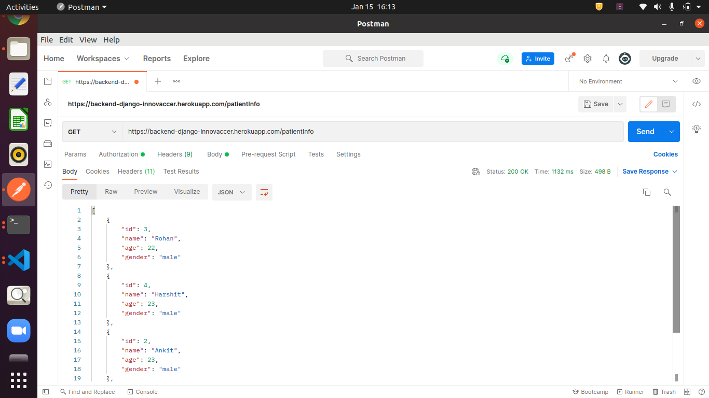
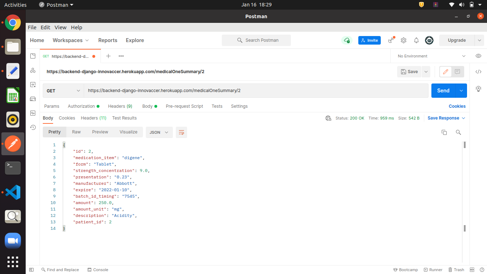
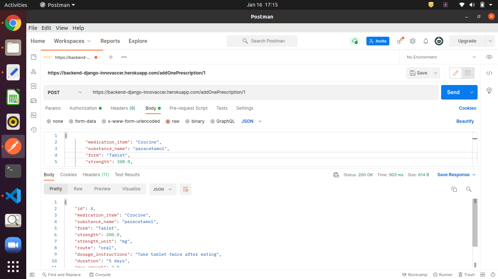
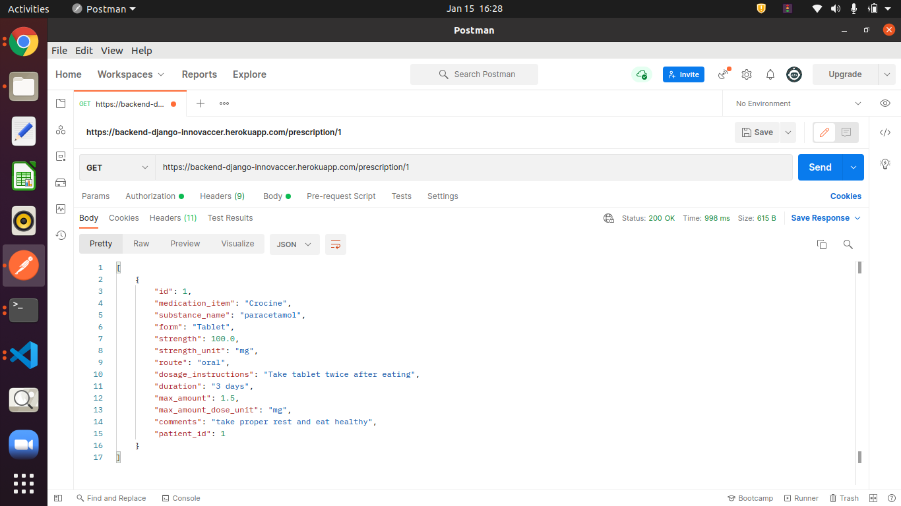
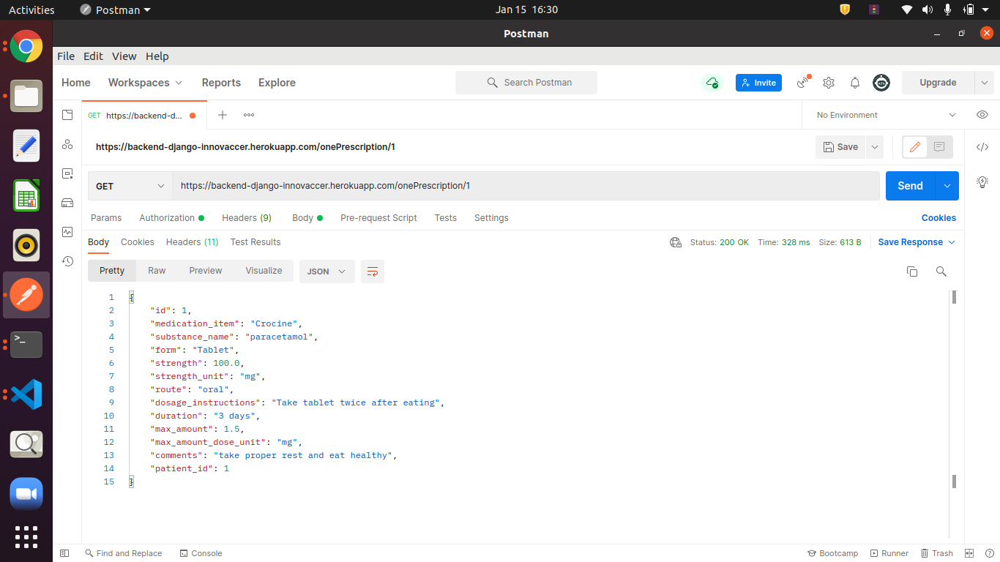
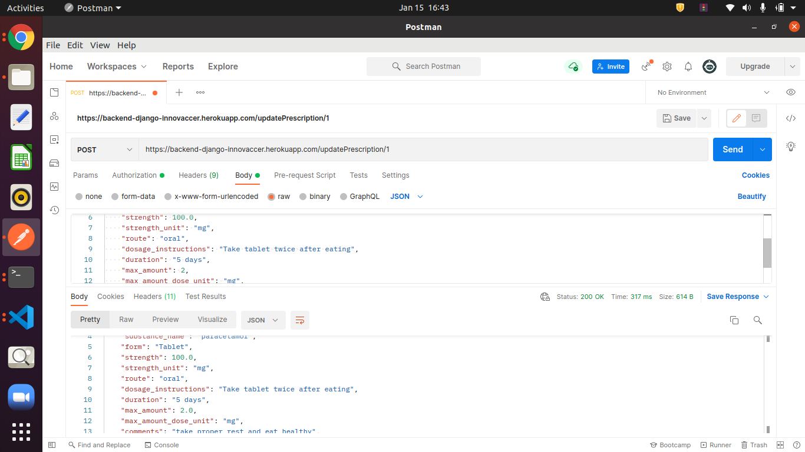
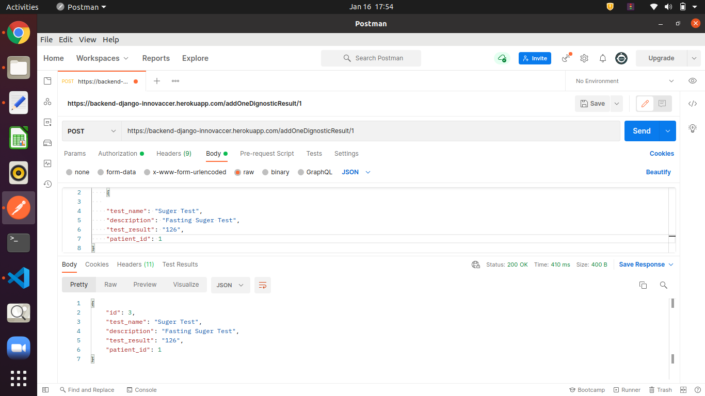
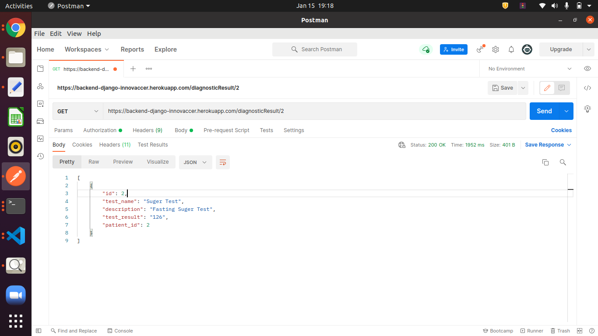
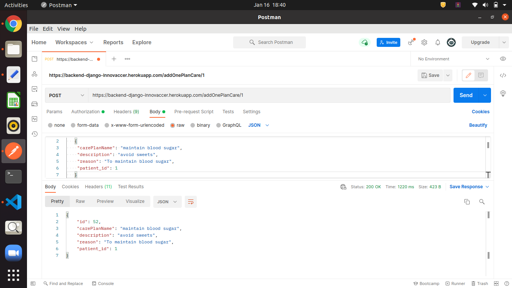
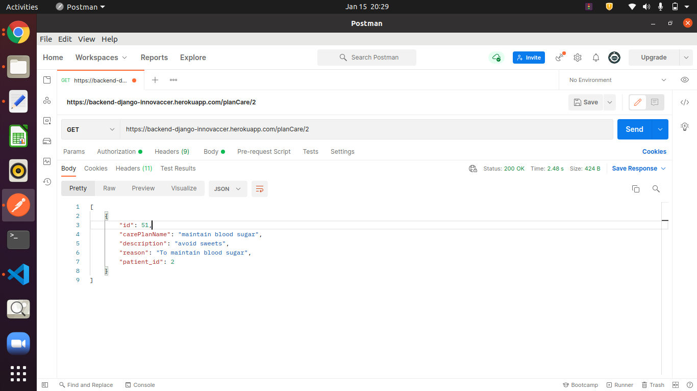

# backend-hackfest

*****************************LOGIN APIS *********************************************************************************
1) Login api -->

 - Doctor can login with validate credentials
 - api Link: https://backend-django-innovaccer.herokuapp.com/api-token-auth/
 - if Doctor not enter validate credentials then he is not login 
 
   
 
*****************************PATIENT INFO APIS ********************************************************************

2) Patient Info Api -->

  - Display all  patient information 
  - api --> https://backend-django-innovaccer.herokuapp.com/patientInfo
  - Method :  GET

  
  
 *****************************MEDICAL SUMMARY APIS *******************************************************************
 
3) Medical Summary Api -->

 - See all Medical Records only for specific patient -
 - api link -https://backend-django-innovaccer.herokuapp.com/medicalSummary/<int:fk>
 - Method: GET
- Show all total medical records available in the database of us specific patient.
- <int:fk> --> pass your patient id here

 

4) View one medical Summery of a patient --->

 - Doctor can view one specific medical Summery of a patient
 - Method: GET
 - api Link --> https://backend-django-innovaccer.herokuapp.com/medicalOneSummary/<int:pk>
 - <int:pk> --> pass medical summary id here
 
   

**********************************EPRESCRIPTION APIS  ************************************************************

5) Add eprescription api -->

 - Doctor add prescription for the patient 
 - Method: POST
 - api Link -->  https://backend-django-innovaccer.herokuapp.com/addOnePrescription/<int:fk>
 - <int:fk> --> pass your patient id here

   

6) view all prescription records of specific patient --->

- Doctor view all specific patient all records
- Method : GET
- api Link : https://backend-django-innovaccer.herokuapp.com/prescription/<int:fk>
- <int:fk> --> pass patient id here

  

7) View Specific prescription of patient -->

- Doctor can view specific prescription of patient
- Method: GET
- api Link :  https://backend-django-innovaccer.herokuapp.com/onePrescription/<int:pk>
- <int:pk> --> pass prescription id here

 

8) Update specific prescription of patient -->

- Doctor can update prescription of specific patient
- Method: POST
- api Link: https://backend-django-innovaccer.herokuapp.com/updatePrescription/<int:pk>
- <int:fk> --> pass prescription id here

*****************************DIAGNOSTIC RESULT APIS *****************************************************************

9) add  diagnosis result --

- Doctor can add diagnosis result of patient
- Method: Post
- api Link ---> https://backend-django-innovaccer.herokuapp.com/addOneDignosticResult/<int:fk>
- <int:fk> --> pass diagnosis id here

 

10) View Diagnosis result of a specific patient -->

  -Method: GET
  - Api Link -->https://backend-django-innovaccer.herokuapp.com/diagnosticOneResult/<int:pk>
 - <int:fk> --> pass Diagnosis id here
 
   
 
 11) View all Diagnosis result of a specific patient -->
 
 - Doctor can view all diagnosis result of a patient
 - Method: GET
 - api Link---> https://backend-django-innovaccer.herokuapp.com/diagnosticResult/<int:pk>
 
  
  
 
 *********************************PATIENT PLAN OF CARE APIS**********************************************************
 
 12) add patient plan of care --> 
 
 - Doctor can add plan of care for the patient
 - Method: POST
 - api LInk -->  https://backend-django-innovaccer.herokuapp.com/addOnePlanCare/<int:fk>
 - <int:fk> --> pass patient id 
 - 
   

 13) View one plan of care specific record -->

 - Doctor can view specific patient one plan of care record
 - Method: GET
 - api Link --https://backend-django-innovaccer.herokuapp.com/planOneCare/<
 - <int:pk> --> pass Plan Of Care id here 
 
   
 
 14) View all plane of care records of specific patient --->
 
 - Doctor can view all plane of care records for specific patient 
 - Method: GET
 - api Link -->  https://backend-django-innovaccer.herokuapp.com/planCare/<int:pk>
 - <int:pk> --> pass patient id 

 
 

  
  
